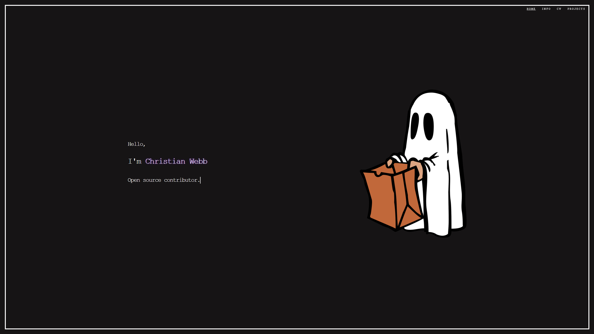

# chriswebbb.github.io

<div id="top"></div>


<!-- PROJECT LOGO -->
<br />
<div align="left">
  
  <a href="https://github.com/chriswebbb/chriswebbb.github.io/tree/master">
    
  </a>
  
  <p align="justify">
    <br />
    Click the link to view said webpage
    <br />
    <a href="https://www.christianwebb.me">View Webpage</a>
    ·
    <a href="https://github.com/othneildrew/Best-README-Template/issues"></a>
    ·
    <a href="https://github.com/othneildrew/Best-README-Template/issues"></a>
  </p>
</div>


<!-- ABOUT THE PROJECT -->
## About The Project

### Built With

* [React.js](https://reactjs.org/)
* [JQuery](https://jquery.com)
* [GH-Pages](https://www.npmjs.com/package/gh-pages)

<p align="right">(<a href="#top">back to top</a>)</p>


<!-- GETTING STARTED -->
## Getting Started

### Prerequisites

You will need [npm](https://www.npmjs.com/) for this. If you already have it installed make sure it is up to date.
* npm
  ```sh
  npm install npm@latest -g
  ```

### Installation

1. Clone the repo
   ```sh
   git clone https://github.com/chriswebbb/chriswebbb.github.io/
   ```

2. Then to test the website on your system the command is.
   ```sh
   npm start
   ```

<p align="right">(<a href="#top">back to top</a>)</p>


<!-- USAGE EXAMPLES -->
## Usage

Use this space to show useful examples of how a project can be used. Additional screenshots, code examples and demos work well in this space. You may also link to more resources.

_For more examples, please refer to the [Documentation](https://example.com)_

<p align="right">(<a href="#top">back to top</a>)</p>

<!-- LICENSE -->
## License

Distributed under the MIT License. See `LICENSE.txt` for more information.

<p align="right">(<a href="#top">back to top</a>)</p>

<!-- ACKNOWLEDGMENTS -->
## Acknowledgments

Use this space to list resources you find helpful and would like to give credit to. I've included a few of my favorites to kick things off!

* [Choose an Open Source License](https://choosealicense.com)
* [GitHub Pages](https://pages.github.com)
* [Font Awesome](https://fontawesome.com)
* [React Icons](https://react-icons.github.io/react-icons/search)

<p align="right">(<a href="#top">back to top</a>)</p>


<!-- MARKDOWN LINKS & IMAGES -->
<!-- https://www.markdownguide.org/basic-syntax/#reference-style-links -->
[product-screenshot]: images/screenshot.png
